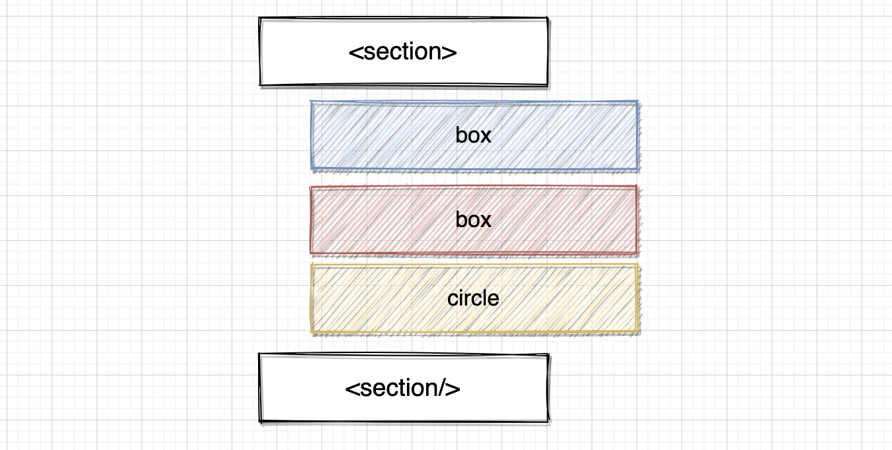
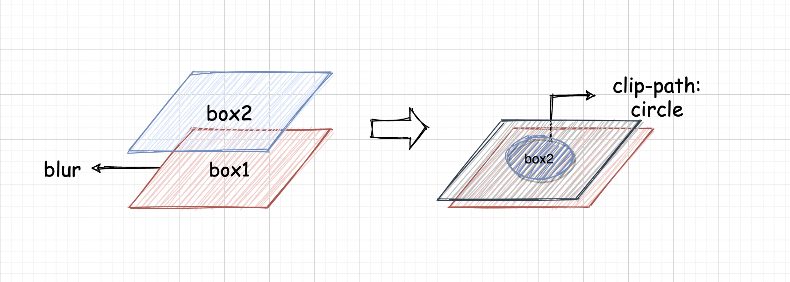

# 1. html



- 전체를 감싸는 부모를 만들기 위해 `<section class="wrap">`을 선언한다.
- `section`의 자식으로 `box1`, `box2`, `circle`을 생성한다.
- `circle`은 미리보기에 있는 돋보기 역할을 한다.
- 두 `box`클래스는 같은 이미지와 자식을 가진 html로, 겹쳐서 사용된다.

```html
<section class="wrap">
  <div class="box">
    <h2>focus</h2>
  </div>
  <div class="box">
    <h2>focus</h2>
  </div>
  <div class="circle" />
</section>
```


# 2. css 

## (1) 내부 요소 중앙 배치시키기

: `wrap`내부와 `box`내부의 요소들이 수직, 수평 중앙 배치시키고자 한다.
: 먼저 `display:flex`를 설정한다.
: 그 다음 수평 중앙 정렬을 위해 `justify-content`을 `center`로 설정한다.
: 마지막으로 수직 중앙 정렬을 위해 `align-items`을 `center`로 설정한다.
: 이렇게 설정하면 해당 dom의 자식들이 수직, 수평으로 중앙 정렬된다!

```css
.wrap,
.box {
  position: absolute;
  top: 0;
  left: 0;
  width:100%;
  height: 100%;
  display: flex;          /*this*/
  justify-content: center;/*this*/
  align-items: center;    /*this*/
   
}
```

## (2) 배경 이미지 설정하기

: 앞서 말했듯이 두 `box`는 같은 자식과 같은 배경이미지를 가져야 한다.
: 두 클래스가 같은 이미지, 자식을 가져야하는 이유는 아래 **(3)**을 보면 이해할 수 있다.
: 일단, `background: url('')`을 사용해 box1,2에 **동일한 배경 이미지**를 설정한다.
: 그 다음 아래와 같은 속성을 이용해 배경이미지의 스타일을 조절한다.

| 속성                  | 설명                                                         |
| --------------------- | ------------------------------------------------------------ |
| background-size       | 배경 이미지 크기 설정 cover로 설정시 너비를 유지하면서 화면을 가득 채움 |
| background-position   | 배경 이미지의 위치 2개의 값을 지정하면 x, y 각각 적용됨 이미지를 중앙에 위치시키려면 center 혹은 center center로 설정 |
| background-attachment | 배경 이미지를 고정할지 자신이 속한 블록과 함께 스크롤할지 지정함 fixed로 설정하면 요소에 스크롤이 존재해도 배경은 함께 스크롤되지 않음 |

```css
.box {
  ...
  background: url('...');       /*this*/
  background-size: cover;       
  background-position: center;  
  background-attachment: fixed; 
  overflow: hidden;  
}
```


## (3) focus filter 효과의 핵심, filter & clip-path

- #### 두 box클래스는 겹쳐서 사용된다!

  - 아래 사진은 focus filter의 핵심인 두 `box 클래스`의 모습이다.
  - 두 box 클래스는 `동일한 배경이미지`와 `h1자식 클래스`를 준 상태이다.
  - 우리는 동그라미 안(돋보기)은 뚜렷한 이미지, 바깥은 흐릿한 이미지를 띄우고 싶다.
  - 그러기 위해서는 동일한 이미지를 가진 두 box 클래스를 아래 그림처럼 겹쳐야한다.



- 그 다음, `box1`에는 filter로 배경 흐림 효과를 주며 `box2`에는 `clip-path`를 지정한다.

> `clip-path`는 해당 dom을 나타날 범위를 정하는 속성이다.
> : 그러므로 `box2`에`clip-path`를 지정하면, 원 안에는 box2가 보이며,
> 원 밖은 box2가 숨겨지고 box1이 보이게 된다.

- 이 말들은 css로 표현하면 아래와 같다.

### box1 에 blur 효과 주기

- 이름이 동일한 box클래스에 다른 효과를 주어야한다
- nth-child(1) 을 이용해, 이름이 box인 `첫번째 class`에 스타일을 줄 수 있다.
- 1번째 box클래스(그림에서는 box1) 에 `blur`  효과를 주어 `흐림 효과`를 준다

``` css
.box:nth-child(1) {
  filter: blur(8px);     
}
```


### box2 에 clip-path 주기

- `clip-path`를 사용해 dom을 보여줄 범위를 지정한다.
- 이 속성을 지정하면 이 범위 안에서는 해당 dom이 보여지고, 바깥에서는 숨겨진다.
- `clip-path`에 `circle`을 지정하면, 원 안에선 dom을 나타내고 원 밖에선 숨긴

```js
.box:nth-child(2) {
  clip-path: circle(150px at 0 0);  /*보여줄 범위 at 원 중앙 지점*/
}
```


## (4) 돋보기 역할인 원 만들기

- circle 클래스는 돋보기 역할을 하는데, 일반적인 원을 만드는 과정과 같다.
- 대신 `translate(0, 0)`는 js의 특정 변수에 의해 조작될 예정이다

```css
.circle {   /*[5]*/
  position: absolute;
  width: 300px;
  height: 300px;
  border: 2px solid #fff;
  border-radius: 50%;   /*50%로 설정하면 원모양이 됨!*/
  box-shadow: 0 5px 23px rgba(0,0,0,0.5);  /*그림자 주기*/
  top: -150px;
  left: -150px;
  transform: translate(0, 0);  /*js에서 조작될 예정*/
}
```


# 3. js

> preview에서 마우스를 따라 원이 움직이고, 글자도 움직인다.
> 이 효과를 주기 위해서는 js가 필요하다! 코드를 구경해보자


## (1) 마우스 위치 받기

```js
const html = document.documentElement;       //[1]

html.addEventListener("mousemove", function(e) {     //[2]
  html.style.setProperty('--x', e.clientX + 'px');   //[3] [4]
  html.style.setProperty('--y', e.clientY + 'px');
})
```

[1] html 요소를 가져온다. (document.body를 사용할 수도 있음)
[2] mousemove(마우스 움직이기) 이벤트 발생시 실행할 함수를 정의한다.
[3] e.clientX, e.clientY로 마우스 커서값을 가져온다.


## (2) setProperty로 변수 만들기

- [4]에서 사용한 코드인 `setProperty`는 속성 지정에 사용된다.
- 형태는 `dom.style.setProperty(속성명, 값, (중요도))`이다.
- setProperty의 속성명에는 무엇을 넣는냐에 따라 사용방법이 달라진다.


### style 속성명을 사용한 경우

- 해당 요소의 이 속성의 스타일이 변경된다

```js
//setProperty 예시(1)
const h1 = document.querySelector('h1');
h1.style.setProperty('color', 'red');   //h1의 color가 red가 됨
```


### --변수명을 사용한 경우

- `setProperty`로 css에서 사용할 변수를 만들 수 있다.
- [4]에서는 `--변수명`을 사용해, 마우스 커서값을 `--x, --y`에 담았다.
- 이 변수는 css에서 `var(--x)`, `var(--y)`형태로 사용할 수 있다.

```js
const html = document.documentElement;   

html.addEventListener("mousemove", function(e) { 
  html.style.setProperty('--x', e.clientX + 'px'); //[4]
  html.style.setProperty('--y', e.clientY + 'px');
})
```


### js에서 선언한 변수 css에서 사용하기

- 앞서 언급했듯이 `setProperty`로 만든 변수는 css에서 `var(변수)`로 사용가능하다.
- js에서 생성했던 `--x`, `--y`는 현재 커서의 위치를 가지고 있다.
- 그러므로 `transform: translate(x,y)`에 `--x, --y`를 사용해 원이나 글자, 원 범위를 이동시킬 수 있게 된다.

```js
/*css*/

.box:nth-child(2) {   /*원 범위 움직이기*/
  clip-path: circle(150px at var(--x) var(--y)); /*보여줄 크기 at 원 중앙 지점*/
}
.box h2{  /*글자 움직이기*/
  position: absolute; 
  transform: translate(calc(var(--x)/25), calc(var(--y)/25));
   /*calc()를 사용해 계산된 값을 사용할 수 있음*/
}

.circle {  /*원 움직이기*/
  ...
  transform: translate(var(--x),var(--y));
}
```


## (3) 페이지로드 됐을 때 바로 블러&필터 효과 적용하기

- 처음 페이지가 로드 됐을 때 블러&필터 효과가 바로 적용되지 않는다.
- 그 이유는 초기에는 --x, --y값이 없기에 해당 속성이 적용되지 않기 때문이다.
- 이를 해결하기 위해 `load`이벤트시 `--x, --y`를 0으로 초기화하면 된다.

```js
//js
window.addEventListener("load", function(){
  html.style.setProperty('--x', 0);
  html.style.setProperty('--y', 0);
});
```


# 4. 작동영상


