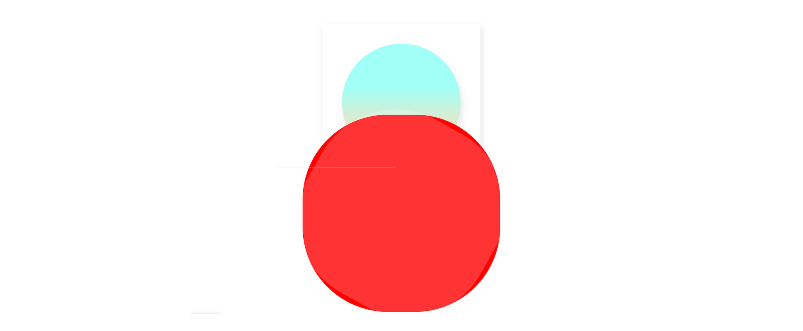
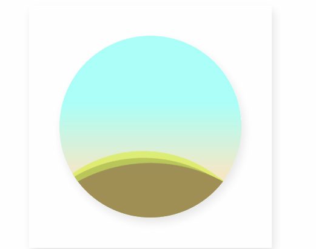

# 구조 

- frame : 네모난 액자 (가운데, 그림자)
  - wrap : 동그란 모양
    - wave
    - wave layer1
    - wave layer2

## 물결 원리

- 사각형의 모퉁이를 둥굴게 깍은 다음 그것을 360도 회전시킴
  - overflow 속성을 이용해 원 안에만 보이게 만듬
- 서로 다른 물결은 아래 두가지의 속성에 차이로 구분지어짐
  - 재생시간 차이
  - 사각형을 돌린 각도 차이

# 완성

