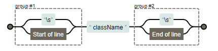

# 1. classToggle 하기

- `RegExp(정규식)` 

  - 객체의 생성자 함수를 호출하는 방법
  - 정규식이 실행 시점에 컴파일이 되기 때문에 정규식 패턴이 변경될 경우에 사용

- `"(\\s|^)" + className + "(\\s|$)"`

  - 정규식 내용

  - 공백문자가아닌내용 + className + 공백문자가아닌내용

    

  

# 2. 버튼의 구성

```html
<div class="heart-btn">
    <div class="content">
        <span class="heart"></span>
        <span class="text">Like</span>
        <span class="numb"></span>
    </div>
</div>
```

- `heart-btn`
  - top : 50%, bottom: 50% 로 왼쪽 위 꼭지점 가운데 위치로 맞추기
  - transform : translate(-50%, -50%)로 정말 버튼 중심이 화면 가운데 가도록 조정
- `content`
  - 테두리 둥굴게 깍고, 굵기 2px로 주고
  - padding 으로 안에 있는 내용물이 너무 붙지 않게
  - cursor : pointer 로 버튼 위에 마우스 올리면 누르는 모양 되도록
  - display : flex로 안쪽을 가로정렬 될 수 있도록
  - 누르면(.`heart-active`)
    - 테두리색과 배경색 변경
- `heart`
  - top : 50%, left : 21% 로 왼쪽 위 꼭지점 위치 맞춰주고
    - transform : translate(-50%, -50%) 로 하트 가운데가 원하는 위치가 되도록 조정
  - 
  - 애니메이션 작동원리
    - background-position : left 를 기본값
    - 누르면 background-position : right 로 0.8초 동안 변하는 애니메이션 수행


